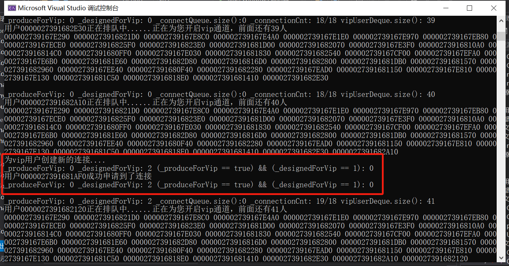
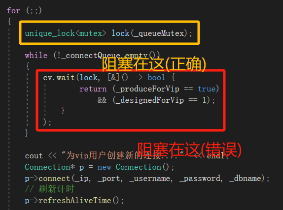

# 云游戏服务器连接池

## 1. 关键技术点
MySQL数据库编程、单例模式、queue队列容器、C++11多线程编程、线程互斥、线程同步通信和unique_lock、基于CAS的原子整形、智能指针shared_ptr、lambda表达式、生产者-消费者线程模型。
<br>


## 2. 连接池功能点介绍

连接池一般包含了数据库连接所用的ip地址、port端口号、用户名和密码以及其它的性能参数，例如初始连接量，最大连接量，最大空闲时间、连接超时时间等，该项目是基于C++语言实现的连接池，主要也是实现以上几个所有连接池都支持的通用基础功能。

**初始连接量（initSize）**：表示连接池事先会和MySQL Server创建initSize个数的connection连接，当应用发起MySQL访问时，不用再创建和MySQL Server新的连接，直接从连接池中获取一个可用的连接就可以，使用完成后，并不去释放connection，而是把当前connection再归还到连接池当中。

**最大连接量（maxSize）**：当并发访问MySQL Server的请求增多时，初始连接量已经不够使用了，此时会根据新的请求数量去创建更多的连接给应用去使用，但是新创建的连接数量上限是maxSize，不能无限制的创建连接，因为每一个连接都会占用一个socket资源，一般连接池和服务器程序是部署在一台主机上的，如果连接池占用过多的socket资源，那么服务器就不能接收太多的客户端请求了。当这些连接使用完成后，再次归还到连接池当中来维护。

**最大空闲时间（maxIdleTime）**：当访问MySQL的并发请求多了以后，连接池里面的连接数量会动态增加，上限是maxSize个，当这些连接用完再次归还到连接池当中。如果在指定的maxIdleTime里面，这些新增加的连接都没有被再次使用过，那么新增加的这些连接资源就要被回收掉，只需要保持初始连
接量initSize个连接就可以了。

**~~连接超时时间（connectionTimeout）~~**

## 3. 功能实现设计 

新的功能点：用户分为普通用户和vip用户，普通用户和vip用户共享初始连接量的连接。当并发量较大时，申请量超过空闲连接时，__即超过初始连接量的连接只提供给vip用户__。会额外创建新的连接供vip用户申请，总的连接不超过最大连接量。当没有空闲的连接供对应类型的用户时，会进入排队等待状态，轮到后可以正常申请连接。

(可选项): 排队时，vip用户无论顺序都排在普通用户前面，可以优先申请连接。

连接池主要包含了以下功能点： 

- 1.连接池只需要一个实例，所以ConnectionPool以单例模式进行设计。 

- 2.从ConnectionPool中可以获取和MySQL的连接Connection。

- 3.空闲连接Connection全部维护在一个线程安全的Connection队列中，使用线程互斥锁保证队列的线程安全。 

- 4.如果Connection队列为空，还需要再获取连接，此时需要动态创建连接，上限数量是maxSize。 

- 5.队列中空闲连接时间超过maxIdleTime的就要被释放掉，只保留初始的initSize个连接就可以了，这个功能点肯定需要放在独立的线程中去做。 

- 6.如果Connection队列为空，而此时连接的数量已达上限maxSize，那么等待connectionTimeout时间，如果还获取不到空闲的连接，那么获取连接失败，此处从Connection队列获取空闲连接，可以使用带超时时间的mutex互斥锁来实现连接超时时间。 

- 7.用户获取的连接用shared_ptr智能指针来管理，用lambda表达式定制连接释放的功能（不真正释放连接，而是把连接归还到连接池中）。 

- 8.连接的生产和连接的消费采用生产者-消费者线程模型来设计，使用了线程间的同步通信机制条件变量和互斥锁。


## 4. 主要功能点的分析

- **阶段一：**
    
    连接池_connectQueue中的连接加上被申请走的连接数量等于initSize, 如果此时_connectQueue中还有空闲连接，那么无论是普通用户还是vip用户都可以直接申请里面的连接。如果_connectQueue中的连接空了，就进入第二阶段。

- **阶段二：**

    此时总的连接数小于maxSize，普通用户想再申请连接，就要**排队**，而vip用户想要再申请连接，可以让生产者生产额外的连接，但是总的数量不能超过maxSize。当总的数量大于等于maxSize时，就进入第三阶段。

- **阶段三：**

    此时总的连接数大于等于maxSize，即使是vip用户，也得进行排队。

- **排队机制：**

    在ConnectionPool中设置两个双端队列deque: 
    ```cpp
    deque<CommonUser*> commonUserDeque;
    deque<VipUser*> vipUserDeque;
    ```
    双端队列支持：

    push_back()——模拟入队<br>
    pop_front()——模拟出队<br>
    erase(iterator it)——通过遍历确定迭代器然后删除，模拟用户退出排队<br>

    ### 用户进入排队等待状态

    比起之前连接池的项目，不再有连接池获取连接的超时时间_connectionTimeout。

    - 对于普通用户，如果判断_connectQueue为空，则将该用户对应的指针放入commonUserDeque中兵进入等待状态，接受cv.notify_all()的唤醒并判断一下条件：
        - _connectQueue是否不为空？
        - vipUserDeque是否为空？即没有vip用户在排队
        - commonUserDeque.front()是不是自己？
        
        若都满足，则让该用户申请走连接

        **注：由于生产者新生产的连接只供给vip用户使用，故这里申请走的连接只能是用户主动析构或用户超时未处理回收到_connectQueue中的连接。**

    - 对于vip用户，如果判断_connectQueue为空，则先确定——总的连接数是否大于等于maxSize，如果没有，则按照连接池项目的申请方法正常申请。如果超过了，就得像普通用户一样排队，但vip用户依然有优先的排队通道：
        - _connectQueue是否不为空？
        - vipUserDeque.front()是不是自己？

    ### 当总连接数小于maxSize,大于initSize时:
    - ConnectionPool::getConnecion()中:
        ```cpp
        _produceForVip = true;  
		cv.wait(lock, [&]() -> bool {
					return _designedForVip == true;
				}
			);
		_designedForVip = false;
        ```
        先把_produceForVip置为true,只有为true的时候，生产者线程才能被唤醒。然后进入等待状态。

    - ConnectionPool::produceConnectionTask()中:
        ```cpp
        cv.wait(lock, [&]() -> bool {
				return _produceForVip == true;
			}
		);
        ```
        ```cpp
        _produceForVip = false;
		_designedForVip = true;

		cv.notify_all(); 
        ```


## 5. 问题解决

- ### 线程池先创建，并启动生产者线程。随后用户开始申请连接，当需要生产者为vip用户创建新的连接时：
    ```cpp
    cv.notify_all();  
    cv.wait(lock, 
        [&]() -> bool {
            return (!_connectQueue.empty()) 
                    && (_designedForVip == 2);
        }
    );
    ```
    先notify_all()，则生产者判断条件成立后由等待进入阻塞：

    ```cpp
    cv.wait(lock, 
    [&]() -> bool {
			return _produceForVip == true;
		}
	);
    ```
    而此刻阻塞的还有其他vip用户也在阻塞，于是当前用户线程想要通知生产者生产线程时，实际上是生产者和其他用户一起抢一个锁。这就导致，如果其他用户抢到锁后，也发起了一个notify通知生产者生产，这时已经有两个用户需要了，但接下来只生产一个，甚至接下来的锁还是被其他用户抢了。


    ### 设置一个标志_priorUser来限定：


    ```cpp
    unique_lock<mutex> lock(_queueMutex);
	cv.wait(lock,
		[&]() -> bool {
			return _priorUser == true;
		}
	);
	_priorUser = false;
    ```
    
    第一个用户进来时，上锁，其他用户阻塞在临界区外，判断条件成立，依然持有锁，然后_priorUser置为false。它申请完连接，就把_priorUser置回true，离开作用域后解锁。其他用户照常进行。

    第二个用户进来时，上锁，其他用户阻塞在临界区外，判断条件成立，依然持有锁，然后_priorUser置为false。它发现没有空闲连接了，就通知生产者生产连接，因为此时_priorUser为false，先notify_all()使生产者从等待进入阻塞，然后wait等待并释放锁，此时如果用户抢到了锁，它会进入wait并判断条件不成立，于是原地等待让出锁，故最终锁还是会交到生产者线程手上。

<br>

- ### 线程之间的同步通信

    在整个项目中，涉及到线程同步通信(wait, notify)的地方包括：

    1. 在获取连接时，为了更好的控制用户线程进出代码临界区，于是通过标签_priorUser来实现，最开始_priorUser为true：
        ```cpp
        cv.wait(lock,
            [&]() -> bool {
                return _priorUser == true;
            }
        );
        _priorUser = false;
        ```
        当该用户线程申请到了连接之后，就把_priorUser置回true，并通知其他用户线程进入临界区进行申请的后续操作。
        ```cpp
        _priorUser = true;
	    _connectQueue.pop();  // 然后弹出
	    cv.notify_all();  // 消费后就通知
        ```

    2. 对于vip用户，申请连接时，如果没有空闲连接，但是_connectionCnt小于_maxSize，连接池可以为vip专门临时申请部分连接使用：
        ```cpp
        _produceForVip = true;
		_designedForVip = 1;
		cv.notify_all();  
		cv.wait(lock, 
			[&]() -> bool {
				return (!_connectQueue.empty()) 
					&& (_designedForVip == 2);
			}
		);
		_designedForVip = 0;
        ```
        这里的_produceForVip一开始是false，置为true并notify_all后，生产者线程就会被唤醒，并在生产完连接后被生产者置回false。
        ```cpp
		cv.wait(lock, 
            [&]() -> bool {
				return (_produceForVip == true)
					&& (_designedForVip == 1);
			}
		);
        ```
        这里的_designedForVip的取值为0,1,2，为了更加准确的让生产者线程和vip用户线程进行通信。

    3. 对于vip用户，申请连接时，如果没有空闲连接，且_connectionCnt大于等于_maxSize，就需要进行排队。
        ```cpp
        vipUserDeque.push_back(dynamic_cast<VipUser*>(_abUser));		
        _priorUser = true;
        cv.notify_all();
        cv.wait(lock, 
            [&]() -> bool {	
                return (!_connectQueue.empty())
                        && vipUserDeque.front() == _abUser;
            }
        );			
        vipUserDeque.pop_front();
        ```
        notify_all后，它会进入等待状态，把锁交由其他线程(但生产者线程不符合唤醒条件，因此还在沉睡，只有其他临界区外的用户)。再次唤醒是需要满足以下的条件：
            
        - _connectQueue不能为空，即必须有空闲连接，不然继续等。
        - 它自己是队头，不然得轮到前面排队的先申请。

    4. 对于普通用户，申请连接时，如果没有空闲连接，需要进行排队。
        ```cpp
        commonUserDeque.push_back(dynamic_cast<CommonUser*>(_abUser));
		_priorUser = true;
        cv.notify_all();
		cv.wait(lock, 
            [&]() -> bool {
				return (!_connectQueue.empty())
					&& vipUserDeque.empty()
					&& commonUserDeque.front() == _abUser
					&& (_designedForVip == 0);
			}
		);
		commonUserDeque.pop_front();
        ```
        同理，但是普通用户的唤醒条件更加多：
        - connectQueue不能为空。
        - vipUserDeque必须为空，即如果vip用户都在排队，就轮不到普通用户。
        - 它是队头。
        - _designedForVip == 0，这个标志平时为0，当vip用户准备让生产者生产专属线程时，这个标志会被置为1；生产者生产完线程后，这个标志会被置为2。如果不设置2这个状态(生产者生产完后置为0)，那么这个专门为vip用户生产的连接可能就被普通用户抢了。

<br>

- ### 生产者线程意外被唤醒

    

    并且输出显示两个标志符号都不满足生产者线程唤醒的条件：
    ```cpp
    while (!_connectQueue.empty())
	{
		cv.wait(lock, [&]() -> bool {
				// 只响应在可创建条件下的vip用户的创建请求
                cout << "_produceForVip: " << _produceForVip << " "
		            << "_designedForVip: " << _designedForVip << endl;
				return (_produceForVip == true)
					&& (_designedForVip == 1);
			}
		);
	}
    ```
    这一块原本的流程大致为：输出排队的所有用户 -> _priorUser置为true，准备把互斥锁交给其他用户 -> cv.notify_all() -> cv.wait()释放锁，其他用户获得锁，然后继续.....

    但根据输出，并没有生产者在等待状态进行判断的迹象(没有打印信息)，而是直接从为vip用户生产新的线程，说明生产者不是从wait中醒来的，而是在被阻塞在代码临界区之外，在vip用户进入等待的同时释放互斥锁，生产者获得了这把锁，进入判定，发现此时_connectQueue是空的，便直接生产连接去了。
    
    于是生产完连接，开始新的循环，此时_connectQueue不在为空，就进入等待，判断一次条件，打印信息。这是被唤醒的vip用户可能是排队在最前面的，也可能是还没进来排队的，它们都满足被唤醒的条件。申请完连接后就notify_all()，可能生产者抢到，就会在判断一次条件，打印输出；如果是用户抢到就没有。

    

    ### 问题已经找到，为什么生产者会有小概率被阻塞在临界区之外呢？
    
    ~~因为最后生产者通知时，标志_priorUser的值为true，这个条件会把还在排队的用户变为阻塞状态，去和生产者竞争互斥锁，其他排队的用户可能会很多，这也说明了这个问题的发生概率比较小。~~

    第_maxSize个用户申请连接，也是目前最后一个生产者可以给他生产额外连接的用户。用户指向notify_all()，此时_priorUser为false，因此其他用户都醒不来，生产者必定拿到这个锁。生产者生产完连接后，也执行notify_all()，这个时候_priorUser依然是false,notify_all()也只唤醒了发出连接申请的用户线程，从等待变为阻塞，然后生产者结束当前循环，释放互斥锁，准备开启一个新的循环。这个时候，有两种情况：
    - <u>生产者抢到了这把互斥锁</u>:
    
        因为刚生产的连接还在_connectQueue还未被取走，故生产者判定_connectQueue.empty()不成立，进入等待状态，交出锁的使用权，自然而然的刚才的用户就获得了锁，取走连接，_priorUser置为true，_designedForVip置为0，这样生产者的唤醒条件不满足，其他用户的唤醒条件满足了，然后notify_all()，于是下一个用户进来申请，这种情况没有问题。

    - <u>刚才的用户抢到了这把互斥锁</u>:

        生产者开启新循环后被阻塞在临界区之外，而用户依旧正常取走了连接, _priorUser被置为true, 后notify_all(), 把所有等待状态的用户变为阻塞状态，即接下来生产者要和所有还在等在申请连接的用户抢一把互斥锁：
        
        - 如果抢到了，因为_connectQueue是空的，因此生产者会生产连接，但是此时总的连接数_connectionCnt已经等于_maxSize了，是不允许生产者继续生产的.....

        - 如果没抢到，即被其他用户抢到了，_priorUser置为true(但本来就是true),执行notify_all()，依然将所有等待状态的用户转为阻塞状态，和生产者一起抢互斥锁，就回到了上面的情况。
    
        如果生产者一直没有抢到锁，那么也不会有问题，但如果会有小概率生产者在某一次判断中抢到了，便会引发情况一的问题。

    ### 解决方法

    只要在第一种互斥锁争抢中，始终让生产者抢到这把锁。由于生产者唤醒需要两个条件：
    - _produceForVip == true
    - _designedForVip == 1

    便在生产完连接后不先把_designedForVip置为2，这样生产者执行notify_all()之后用户不会唤醒而进入阻塞状态。同时等生产者在新循环中获得互斥锁后再把_designedForVip置为2，然后notify_all()，这时用户才被唤醒进入阻塞状态。

    ```cpp
    for (;;)
	{
		unique_lock<mutex> lock(_queueMutex);

		while (!_connectQueue.empty())
		{
        // ################# 新的代码段 #################
			_designedForVip = 2;
			cv.notify_all();
        // #############################################
			cv.wait(lock, [&]() -> bool {
					return (_produceForVip == true)
						&& (_designedForVip == 1);
				}
			);
		}
		cout << "为vip用户创建新的连接...."  << endl;
		Connection* p = new Connection();
		p->connect(_ip, _port, _username, _password, _dbname);
		p->refreshAliveTime();  // 刷新计时
		_connectQueue.push(p);
		_connectionCnt++;
		_produceForVip = false;
	
		/*_designedForVip = 2;*/

		cv.notify_all();  // 通知消费者线程，可以消费连接了
	}
    ```

   ### 但是上面的方法又影响了普通用户的使用：
    由于连接池启动的时候，生产者线程会进入临界区，判断条件后进入等待状态，会把_designedForVip置为2，而这不满足普通用户的唤醒条件：
    ```cpp
    return (!_connectQueue.empty())
			&& vipUserDeque.empty()
			&& commonUserDeque.front() == _abUser
			&& (_designedForVip == 0);
    ```
    因此即使之前申请的连接被回收了，排队的用户也无法被唤醒。

    _designedForVip的设置之处是为了应对以下场景：一个普通用户进来申请——没有空闲连接：等待。之后一个vip用户进来申请连接——没有空闲连接，但生产者可以为他生产。它先进入等待状态，生产者生产完毕后会通知，vip用户申请连接等待生产者生产时的唤起条件：
    ```cpp
    [&]() -> bool {
		return (!_connectQueue.empty()) 
			&& (_designedForVip == 2);
	}
    ```
    普通用户排队等待的唤起条件：
    ```cpp
    [&]() -> bool {
        return (!_connectQueue.empty())
            && vipUserDeque.empty()
            && commonUserDeque.front() == _abUser
            && (_designedForVip == 0);
	}
    ```
    如果没有_designedForVip，且等待的用户只有一个(那他就是队头)，同时vip用户既然还能让生产者生产连接，就说明没有vip用户在排队，因此，普通用户和vip用户都会被唤醒，可能存在vip用户让生产者生产的连接被普通用户抢走。

    超时回收连接并放回连接池中：
    ```cpp
    _Connection.reset();
	_Connection = nullptr;
    // ################# 新的代码段 #################
	_connectionPool->_designedForVip = 0;
    // #############################################
    ```

<br>

- ### 信号量(Semaphore)替换_connectQueue中的队列queue的可能性

    计数信号量：
    ```cpp
    std::counting_semaphore<_initSize> _connectSemaphore(_initSize);
    ```
    当线程或进程需要访问共享资源时，它会尝试获取信号量。如果信号量的计数值大于0，则将其减1并允许线程或进程继续执行；**如果信号量的计数值为0，则线程或进程将被阻塞**，**直到信号量的计数值大于0**。

    计数信号量本身只是个计数，并不能获取具体资源本身如connection。但是可以和_connectQueue一起使用:
    ```cpp
    // 判断申请连接的是普通用户还是vip用户
	if (dynamic_cast<CommonUser*>(_abUser) != nullptr)
    {
        /*
            这里信号量的计数对应_connectionQueue.size(), 
            当_connectQueue的计数为0，即队列内没有空闲连接时，
            线程会被阻塞在这里，
            直到_connectQueue的计数大于0，有空闲连接时。
        */
        _connectSemaphore.acquire();

        shared_ptr<Connection> sp(_connectQueue.front(),
    		[&](Connection* pcon) { 
			    unique_lock<mutex> lock(_queueMutex);
			    // 刷新计时
			    pcon->refreshAliveTime();
			_   connectQueue.push(pcon);
		    }
	    );   // 取队头

	    _priorUser = true;
	    _connectQueue.pop();  // 然后弹出
	    cv.notify_all();  // 消费后就通知

	    return sp;
    }
    ```
